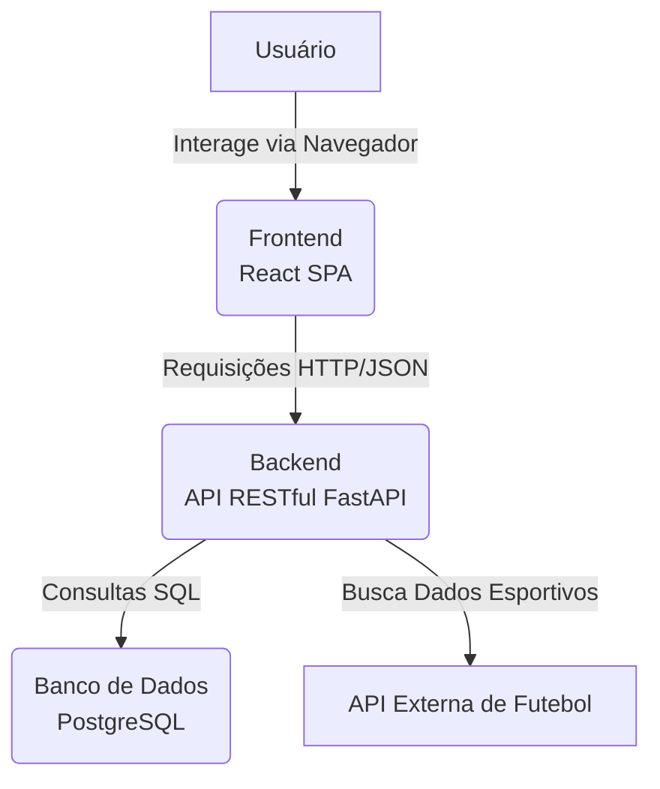

# Documento de Arquitetura

## Introdução

Este documento descreve a arquitetura de software da plataforma **Hub do Torcedor**. O objetivo é fornecer uma visão geral de alto nível dos componentes do sistema, suas responsabilidades, interações e os padrões de design que guiam a sua construção. A arquitetura foi projetada para ser modular, escalável e manutenível, utilizando uma abordagem moderna de desenvolvimento web com separação clara de responsabilidades entre o cliente (frontend) e o servidor (backend).

## Visão Geral da Arquitetura

A plataforma adota uma **arquitetura de microsserviços desacoplada**, baseada em uma comunicação via API RESTful. Os principais componentes são:

1.  **Frontend (Single-Page Application):** Uma aplicação rica e interativa que roda no navegador do usuário, construída com React. É responsável por toda a interface e experiência do usuário.
2.  **Backend (API RESTful):** Um serviço responsável por toda a lógica de negócio, gerenciamento de dados e comunicação com serviços externos. Construído com FastAPI.
3.  **Banco de Dados:** Um banco de dados relacional PostgreSQL, responsável pela persistência de todos os dados da aplicação.
4.  **API Externa:** Um serviço de terceiros (ex: API-Football) que fornece os dados em tempo real sobre partidas e estatísticas de futebol.

A comunicação principal ocorre quando o Frontend envia requisições HTTP (ex: GET, POST) para o Backend, que por sua vez processa a requisição, interage com o Banco de Dados e retorna os dados em formato JSON.

### Diagrama da Arquitetura

**Figura 1:** Diagrama de Arquitetura de Alto Nível

<div align="center">



<p><strong>Fonte:</strong> Lucas Víctor, 2025</p>
</div>

## Padrão de Design: Model-View-Controller (MVC)

O projeto aplica os princípios do padrão de design MVC de forma distribuída entre o backend e o frontend, aproveitando o melhor de cada tecnologia.

**Tabela 1:** Aplicação do Padrão MVC no Projeto

<div align="center">

<p><strong>Tabela 1:</strong> Aplicação do Padrão MVC no Projeto</p>

<table>
  <thead>
    <tr>
      <th>Componente MVC</th>
      <th>Responsabilidade no Backend (FastAPI)</th>
      <th>Responsabilidade no Frontend (React)</th>
    </tr>
  </thead>
  <tbody>
    <tr>
      <td><strong>Model (Modelo)</strong></td>
      <td>Classes <strong>SQLAlchemy</strong> que mapeiam as tabelas do banco de dados e contêm a lógica de negócio.</td>
      <td>O <strong>estado dos componentes</strong>, gerenciado por hooks como <code>useState</code> e <code>useEffect</code>, que armazena os dados vindos da API.</td>
    </tr>
    <tr>
      <td><strong>View (Visão)</strong></td>
      <td>Esquemas <strong>Pydantic</strong> que definem a estrutura e formato dos dados de resposta (JSON).</td>
      <td>Os <strong>Componentes e seu JSX</strong>, que renderizam o HTML e formam a interface com a qual o usuário interage.</td>
    </tr>
    <tr>
      <td><strong>Controller (Controlador)</strong></td>
      <td>Os <strong>Endpoints/Rotas</strong> (<code>@app.get</code>, <code>@app.post</code>) que recebem as requisições, orquestram as ações e retornam a resposta.</td>
      <td>As <strong>funções e manipuladores de eventos</strong> (<code>onClick</code>, <code>onSubmit</code>) dentro dos componentes que respondem às ações do usuário.</td>
    </tr>
  </tbody>
</table>

<p><strong>Fonte:</strong> Lucas Víctor, 2025</p>


</div>


### Estrutura de Diretórios Proposta

A estrutura de pastas do projeto refletirá diretamente o padrão MVC para garantir a organização do código.

**Backend (FastAPI):**

```
backend/
└── app/
    ├── models/         # (M) Modelos SQLAlchemy
    ├── schemas/        # (V) Esquemas Pydantic
    ├── routers/        # (C) Controladores (Endpoints)
    ├── services/       # Lógica de negócio extra
    ├── database.py     # Configuração do BD
    └── main.py         # Ponto de entrada da aplicação
```

**Frontend (React):**

```
frontend/
└── src/
    ├── components/     # (V) Componentes reutilizáveis (Botões, Cards)
    ├── pages/          # (V) Páginas completas (Login, Dashboard)
    ├── services/       # (C) Lógica de chamada à API
    ├── contexts/       # (M) Gerenciamento de estado global
    └── App.js          # Ponto de entrada da aplicação
```

## Tecnologias Utilizadas

  * **Backend:** Python 3.9+, FastAPI, SQLAlchemy, Pydantic, Uvicorn.
  * **Frontend:** JavaScript, React 18+, Axios.
  * **Banco de Dados:** PostgreSQL 13+.
  * **Infraestrutura e Ambiente:** Docker, Docker Compose.

## Histórico de Versões

| Versão | Data | Descrição | Autor | Revisor |
| :---: | :---: | :--- | :---: | :---: |
| `1.0` | 25/09/2025 | Criação do documento, definindo a arquitetura, o padrão MVC e as tecnologias. | [Lucas Víctor](https://github.com/Lucas13032003) | [Lucas Víctor](https://github.com/Lucas13032003) |


