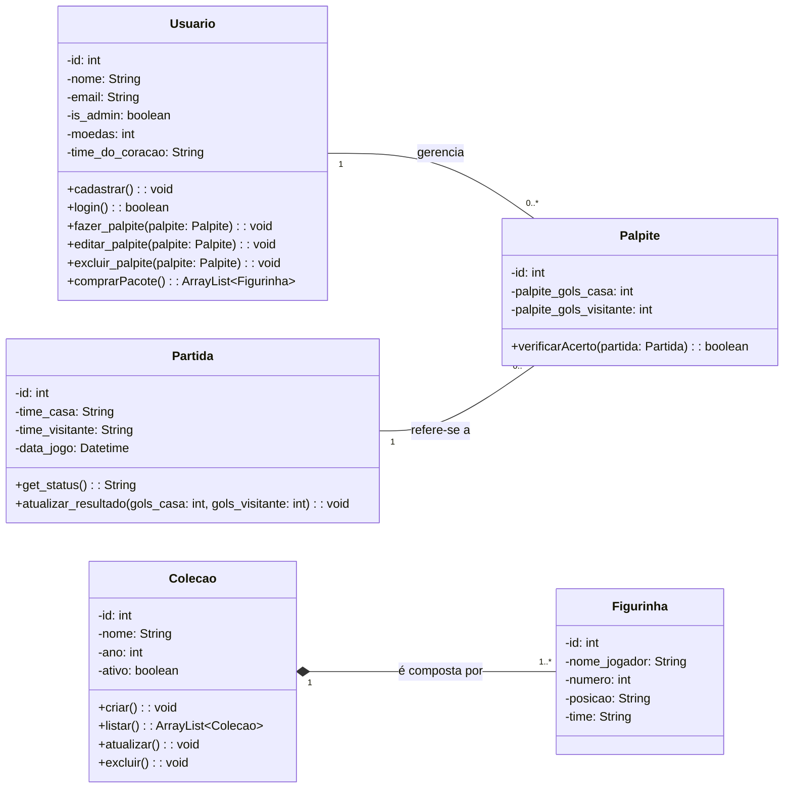

# Diagramas UML

Esta seção apresenta os diagramas UML que modelam a estrutura e o comportamento do sistema "Hub do Torcedor", conforme exigido pelo Passo 6 do checklist do projeto.

## 1. Diagrama de Classes

O diagrama abaixo modela as entidades do MVP, seus atributos e relacionamentos.

**Diagrama gerado via Mermaid:**



**Diagrama gerado via Ferramenta Externa (Astah):**

<p align="center">
  
</p>


## 2\. Diagrama de Sequência

O diagrama a seguir ilustra o fluxo de interação entre os componentes do sistema durante o caso de uso **"Comprar Pacote de Figurinhas"**, um dos fluxos mais importantes da aplicação.

**Diagrama gerado via Mermaid:**

```mermaid
sequenceDiagram
    participant Usuário as Frontend (React)
    participant API as Rota (FastAPI)
    participant Controller as Lógica de Negócio
    participant DB as Banco de Dados (PostgreSQL)

    Usuário->>+API: 1. POST /loja/comprar-pacote
    API->>+Controller: 2. Chama comprar_pacote(usuario_id)
    
    Controller->>+DB: 3. Verificar saldo de moedas do usuário
    DB-->>-Controller: 4. Retorna saldo
    
    alt Saldo suficiente
        Controller->>+DB: 5. Subtrair moedas do usuário
        DB-->>-Controller: (Confirmação)
        
        Controller->>+DB: 6. Sortear N figurinhas
        DB-->>-Controller: (Confirmação)

        Controller->>+DB: 7. Adicionar figurinhas à coleção do usuário
        DB-->>-Controller: 8. Confirma transação

        Controller-->>-API: 9. Retorna sucesso com as figurinhas ganhas (JSON)
    else Saldo insuficiente
        Controller-->>-API: 9. Retorna erro de saldo
    end

    API-->>-Usuário: 10. Resposta HTTP
```

**Diagrama gerado via Ferramenta Externa (Astah):**
*(Local para a imagem que você exportar do seu software)*

```

```

## Histórico de Versões

| Versão | Data | Descrição | Autor | Revisor |
| :----: | :------------: | ----------------------------------------------------------------------- | :---------: | :---------: |
| `1.0` | 28/09/2025 | Criação do documento com o Diagrama de Classes. | [Lucas Víctor](https://github.com/Lucas13032003) | [Lucas Víctor](https://github.com/Lucas13032003) |
| `2.0` | 28/09/2025 | Adição do Diagrama de Sequência e placeholders para imagens. | [Lucas Víctor](https://github.com/Lucas13032003) | [Lucas Víctor](https://github.com/Lucas13032003) |
